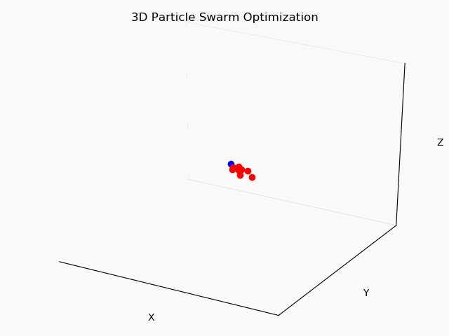

My first particle swarm optimization program.

Algo is below



At each time step we draw two unifrom numbers for each particle, noted U<sub>i1</sub> and U<sub>i2</sub>, and we have/can have 3 tuning parameter w 1->3

```
updated_velocity for particle i = w<sub>1</sub> * previous_velocity  +  w<sub>2</sub> * U<sub>i1</sub> * (previous_best_position - current_position) + w<sub>3</sub> * U<sub>i2</sub> * (previous_best_group_position - current_position)

```
Then we update position with :

```
Pos = current_pos + updated_velocity

```
