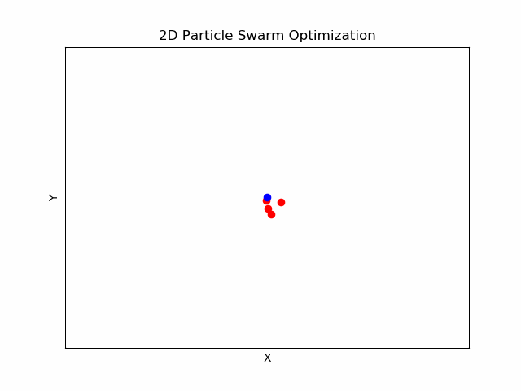

# Multi-Agent-Systems

At the top left you see agents moving randomly to find tasks. The tasks need 3 agents working on it for  
it to be solved. The green circle that you see is a signal sent out to anyone inside of the area to ask for help.

  
  
A Particle swarm optimization. At each time step every particle updates their direction and velocity according to  
their own best overall position to the signal (blue dot), and the overall best position for every particle.

